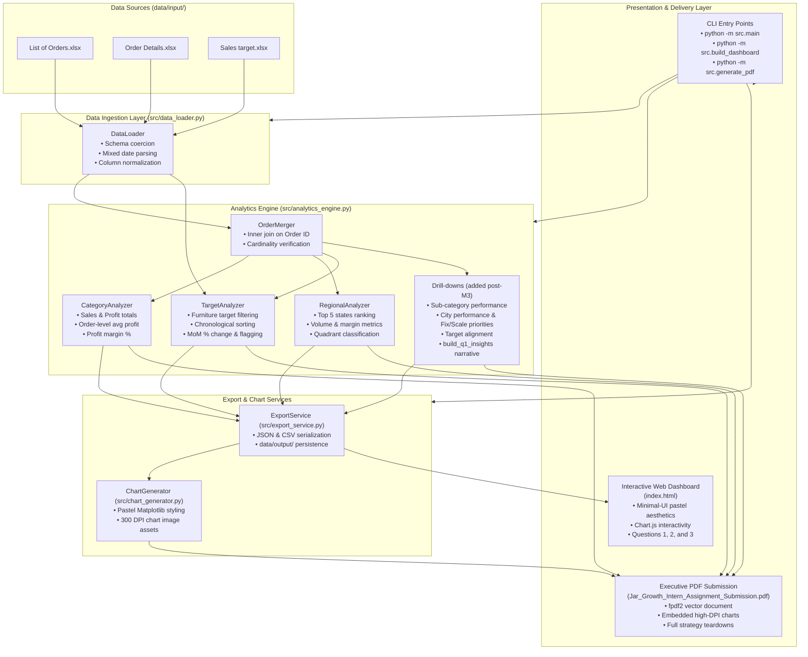

# Technical Architecture: Jar Growth Intern Assignment

## 1. System Overview & Posture

This architecture defines the end-to-end design for the Jar Growth Intern Assignment submission. The system delivers a production-grade, mathematically verified analytics engine, an interactive minimal-UI pastel web application, and an automated publication-grade executive PDF generator.

### Architectural Posture: Production
- **Boundary Validation**: Strict schema enforcement, type validation, and format coercion at all ingestion boundaries.
- **Defensive Computation**: Deterministic handling of negative profits, chronological baselines, and zero-division guards.
- **Reproducibility**: Modular, pure-function pipelines with zero side-effects in analytics routines.
- **Portability**: Pure-Python stack with zero native C-library dependencies (e.g., avoiding GTK/Pango dependencies of WeasyPrint).

---

## 2. Technology Stack

| Layer | Technology | Version | Purpose |
| :--- | :--- | :--- | :--- |
| **Language** | Python | `>=3.10` | Core computational runtime |
| **Data Processing** | `pandas` | `>=2.0.0` | High-performance tabular data ingestion, merging, and aggregation |
| **Numeric Computing** | `numpy` | `>=1.24.0` | Numerical calculations, array operations, and NaN representations |
| **Excel Ingestion** | `openpyxl` | `>=3.1.0` | Reading raw `.xlsx` multi-sheet workbooks |
| **PDF Generation** | `fpdf2` | `>=2.7.0` | Pure-Python executive PDF document generation with vector styling |
| **Data Visualization** | `matplotlib` | `>=3.7.0` | High-DPI publication chart rendering with pastel color palettes |
| **Web Dashboard** | HTML5 / CSS3 / ES6+ | Modern Web | Client-side responsive dashboard inspired by `minimal-ui-kit/material-kit-react` |
| **Interactive Charts** | `Chart.js` | `^4.4.0` (CDN) | Zero-build, interactive vector charts in the web application |
| **Test Runner** | `pytest` | `>=7.4.0` | Automated unit, regression, and integration testing |

### Exact Test Command
```bash
python -m pytest -v
```

---

## 3. Component Architecture



### Component Descriptions
- **`DataLoader` (`src/data_loader.py`)**: Ingests Excel workbooks, strips whitespace, standardizes column casing, and coerces heterogeneous date formats into standard datetime objects.
- **`OrderMerger` (`src/analytics_engine.py`)**: Performs inner joins on `Order ID` between order headers and line-item details, asserting data hygiene and tracking record counts.
- **`CategoryAnalyzer` (`src/analytics_engine.py`)**: Computes category-level total sales, total profit, order-level category average profit, and profit margin percentages.
- **`TargetAnalyzer` (`src/analytics_engine.py`)**: Evaluates Furniture target sales chronologically, computing MoM percentage fluctuations, flagging $|MoM| \ge 15\%$, and comparing actual achievement.
- **`RegionalAnalyzer` (`src/analytics_engine.py`)**: Ranks states by order volume, computes state-level profitability metrics, and categorizes states into performance quadrants.
- **Drill-downs (`src/analytics_engine.py`, added after M3)**: Sub-category performance, city performance, Fix/Scale city priorities, Furniture target alignment, and `build_q1_insights`, which builds the Q1 narrative shared by the PDF and the dashboard.
- **`ExportService` (`src/export_service.py`)**: Serializes analytical results into clean JSON and CSV formats stored in `data/output/` for dashboard and archival use.
- **`build_dashboard` (`src/build_dashboard.py`)**: Embeds every `data/output/*.json` file into the `<script id="dashboard-data">` block of `index.html`.
- **Q2/Q3 content (`src/content/`)**: `ux_teardown.py` and `growth_strategy.py` hold the Jar UX teardown and growth strategy as typed dataclasses, exported to `ux_teardown.json` and `growth_strategy.json`.
- **`ChartGenerator` (`src/chart_generator.py`)**: Renders publication-grade, pastel-themed chart PNGs at 300 DPI using Matplotlib for automated embedding in the PDF.
- **`PdfGenerator` (`src/pdf_generator.py`)**: Compiles the comprehensive A4 executive submission PDF (`Jar_Growth_Intern_Assignment_Submission.pdf`) using `fpdf2`.
- **`Interactive Web Dashboard` (`index.html`)**: Single-page static web application styled with `minimal-ui-kit/material-kit-react` pastel aesthetics (see `DESIGN.md`), presenting interactive charts and teardowns for Questions 1, 2, and 3.

---

## 4. Data Models & Validation Rules

### Ingestion Data Models

```python
from dataclasses import dataclass
from datetime import datetime
from typing import Optional

@dataclass(frozen=True)
class RawOrderRecord:
    order_id: str
    order_date: datetime
    customer_name: str
    state: str
    city: str

    def __post_init__(self):
        if not self.order_id or not self.order_id.strip():
            raise ValueError("order_id cannot be blank or whitespace")
        if not isinstance(self.order_date, datetime):
            raise TypeError(f"order_date must be datetime, got {type(self.order_date)}")
        if not self.state or not self.state.strip():
            raise ValueError("state cannot be blank")

@dataclass(frozen=True)
class RawOrderDetailRecord:
    order_id: str
    amount: float
    profit: float
    quantity: int
    category: str
    sub_category: str

    def __post_init__(self):
        if not self.order_id or not self.order_id.strip():
            raise ValueError("order_id cannot be blank")
        if self.amount < 0:
            raise ValueError(f"amount cannot be negative: {self.amount}")
        if self.quantity < 1:
            raise ValueError(f"quantity must be >= 1: {self.quantity}")
        if self.category not in {"Clothing", "Electronics", "Furniture"}:
            raise ValueError(f"Unrecognized category: {self.category}")

@dataclass(frozen=True)
class RawSalesTargetRecord:
    month_of_order_date: str
    category: str
    target: float

    def __post_init__(self):
        if not self.month_of_order_date or not self.month_of_order_date.strip():
            raise ValueError("month_of_order_date cannot be blank")
        if self.target <= 0:
            raise ValueError(f"target must be strictly positive: {self.target}")
```

### Analytics Output Data Models

```python
@dataclass(frozen=True)
class CategoryPerformance:
    category: str
    total_sales: float
    total_profit: float
    avg_profit_per_order: float
    profit_margin_pct: float
    distinct_orders: int
    total_quantity: int
    performance_rank: int

    def __post_init__(self):
        expected_margin = round((self.total_profit / self.total_sales) * 100, 2) if self.total_sales > 0 else 0.0
        if round(self.profit_margin_pct, 1) != round(expected_margin, 1):
            raise ValueError(f"Margin mismatch: got {self.profit_margin_pct}, expected {expected_margin}")

@dataclass(frozen=True)
class FurnitureTargetAchievement:
    month_key: str              # ISO YYYY-MM
    display_month: str          # e.g., 'Apr-18'
    target_sales: float
    actual_sales: float
    mom_target_pct_change: Optional[float]  # None for Apr-18 baseline
    mom_actual_pct_change: Optional[float]
    variance: float             # Actual - Target
    achievement_pct: float      # (Actual / Target) * 100
    is_significant_fluctuation: bool        # True if |mom_target_pct_change| >= 15.0%

@dataclass(frozen=True)
class StatePerformance:
    rank: int
    state: str
    distinct_orders: int
    total_sales: float
    total_profit: float
    avg_profit_per_order: float
    profit_margin_pct: float
    quadrant: str               # 'High Volume / High Margin', 'High Volume / Low Margin', etc.

# Added after M3 (validation rules live in __post_init__ in src/analytics_engine.py)
@dataclass(frozen=True)
class CityPerformance:
    state: str
    city: str
    distinct_orders: int
    total_sales: float
    total_profit: float
    avg_profit_per_order: float
    profit_margin_pct: float

@dataclass(frozen=True)
class SubCategoryPerformance:
    category: str
    sub_category: str
    total_sales: float
    total_profit: float
    profit_margin_pct: float
    distinct_orders: int
    total_quantity: int
    avg_order_value: float      # total_sales / distinct_orders
    avg_profit_per_order: float # total_profit / distinct_orders

@dataclass(frozen=True)
class CityPriority:
    action: str                 # 'Fix' or 'Scale'
    state: str
    city: str
    total_sales: float
    total_profit: float
    profit_margin_pct: float
    profit_gap: float           # sales x overall margin - profit (positive = below average)
    in_top_states: bool
    reason: str
```

---

## 5. Interfaces & Contract Specifications

### Module Functions & Class Signatures

#### `DataLoader` (`src/data_loader.py`)
```python
class DataLoader:
    """Handles loading and sanitization of raw Excel files."""
    
    @staticmethod
    def load_orders(file_path: Path) -> pd.DataFrame:
        """
        Loads List of Orders.xlsx.
        
        Args:
            file_path: Path to List of Orders.xlsx
        Returns:
            pd.DataFrame with columns: ['order_id', 'order_date', 'customer_name', 'state', 'city']
        Raises:
            FileNotFoundError: If file is missing.
            KeyError: If required columns are missing.
            ValueError: If parsing date format fails completely.
        """
        ...

    @staticmethod
    def load_order_details(file_path: Path) -> pd.DataFrame:
        """
        Loads Order Details.xlsx.
        
        Args:
            file_path: Path to Order Details.xlsx
        Returns:
            pd.DataFrame with columns: ['order_id', 'amount', 'profit', 'quantity', 'category', 'sub_category']
        Raises:
            FileNotFoundError: If file is missing.
            ValueError: If numeric columns cannot be cast.
        """
        ...

    @staticmethod
    def load_sales_targets(file_path: Path) -> pd.DataFrame:
        """
        Loads Sales target.xlsx.
        
        Args:
            file_path: Path to Sales target.xlsx
        Returns:
            pd.DataFrame with columns: ['month_of_order_date', 'category', 'target']
        Raises:
            FileNotFoundError: If file is missing.
        """
        ...
```

#### `AnalyticsEngine` (`src/analytics_engine.py`)
```python
class AnalyticsEngine:
    """Performs all deterministic aggregations for Question 1."""

    @staticmethod
    def merge_orders(orders_df: pd.DataFrame, details_df: pd.DataFrame) -> pd.DataFrame:
        """
        Inner joins orders and details on order_id.
        
        Returns:
            pd.DataFrame containing all normalized transaction line items.
        """
        ...

    @staticmethod
    def compute_category_performance(merged_df: pd.DataFrame) -> List[CategoryPerformance]:
        """
        Computes sales, profit, order-level average profit, and margin % per Category.
        """
        ...

    @staticmethod
    def compute_furniture_target_mom(
        targets_df: pd.DataFrame, 
        merged_df: pd.DataFrame,
        fluctuation_threshold_pct: float = 15.0
    ) -> List[FurnitureTargetAchievement]:
        """
        Computes chronological MoM % change in Furniture sales target and reconciles with actuals.
        """
        ...

    @staticmethod
    def compute_top_states_performance(
        orders_df: pd.DataFrame, 
        merged_df: pd.DataFrame, 
        top_n: int = 5
    ) -> List[StatePerformance]:
        """
        Ranks top states by distinct order volume and evaluates regional profitability metrics.
        """
        ...

    # Added after M3
    @staticmethod
    def compute_city_performance(merged_df: pd.DataFrame, state: Optional[str] = None) -> List[CityPerformance]:
        """City-level sales, profit and margin, optionally filtered to one state."""

    @staticmethod
    def compute_subcategory_performance(merged_df: pd.DataFrame) -> List[SubCategoryPerformance]:
        """Sales, profit, margin and orders per (Category, Sub-Category); loss-makers kept."""

    @staticmethod
    def compute_target_alignment(furniture_data: List[FurnitureTargetAchievement], window: int = 3) -> Dict[str, Any]:
        """Half-year split, seasonal re-phasing and rolling-baseline error of the flat target ramp."""

    @staticmethod
    def compute_city_priorities(merged_df: pd.DataFrame, state_data: List[StatePerformance],
                                fix_n: int = 4, scale_n: int = 2) -> List[CityPriority]:
        """Names the cities to fix (largest profit gap) and to scale (high sales, above-average margin)."""

    @staticmethod
    def build_q1_insights(category_data, subcategory_data, furniture_data, state_data, city_priorities) -> Dict[str, Any]:
        """Builds the data-driven Q1 narrative shared by the PDF and the dashboard (q1_insights.json)."""
```

#### `ChartGenerator` (`src/chart_generator.py`)
```python
class ChartGenerator:
    """Generates high-resolution pastel charts using Matplotlib."""

    @classmethod
    def generate_all_charts(
        cls,
        category_data: List[CategoryPerformance],
        furniture_data: List[FurnitureTargetAchievement],
        state_data: List[StatePerformance],
        output_dir: Optional[Union[Path, str]] = None,
        dpi: int = DPI,
    ) -> Dict[str, Path]:
        """
        Renders and saves 300 DPI chart images:
        1. category_profitability.png
        2. furniture_target_vs_actual.png (also saved as furniture_target_trajectory.png)
        3. regional_performance.png (also saved as state_regional_quadrants.png)
        """
        ...
```

#### `PdfGenerator` (`src/pdf_generator.py`)
```python
class PdfGenerator:
    """Compiles the executive PDF submission using fpdf2."""

    def __init__(self, chart_paths: Optional[Dict[str, Path]] = None):
        ...

    def build_submission_pdf(
        self,
        output_path: "str | Path",
        category_data: List[CategoryPerformance],
        furniture_data: List[FurnitureTargetAchievement],
        state_data: List[StatePerformance],
        charts_dir: Optional[Path] = None,
        subcategory_data: Optional[List[SubCategoryPerformance]] = None,
        city_priorities: Optional[List[CityPriority]] = None,
        q1_insights: Optional[Dict[str, Any]] = None,
    ) -> Path:
        """
        Builds Jar_Growth_Intern_Assignment_Submission.pdf with cover,
        executive summary, Q1 analysis, Q2 UX teardown, and Q3 growth strategy.
        """
        ...
```

### CLI Command Interfaces

| Command | Action | Output Artifacts |
| :--- | :--- | :--- |
| `python -m src.main` | Runs ingestion, analytics engine, prints console summaries, and exports data. | `data/output/*.json`, `data/output/*.csv` |
| `python -m src.build_dashboard` | Embeds every `data/output/*.json` into the `<script id="dashboard-data">` block of `index.html`. Run after `src.main`. | `index.html` (rewritten in place) |
| `python -m src.generate_pdf` | Renders pastel charts and builds the executive PDF report. | `data/output/Jar_Growth_Intern_Assignment_Submission.pdf`, `assets/charts/*.png` |
| `python -m pytest -v` | Executes complete automated test suite across all units. | Terminal test results report |

---

## 6. Directory Layout

```
GrowthInternJar/
├── index.html                             # Interactive minimal-UI pastel web dashboard
├── DESIGN.md                              # Dashboard design system (tokens, type, components)
├── PRODUCT.md                             # Dashboard purpose, audience and constraints
├── .impeccable/                           # Design-tool metadata for index.html
├── .env.example                           # Template environment configuration
├── requirements.txt                       # Production & development dependencies
├── docs/
│   ├── Jar - Growth Intern Assignment.pdf # Original assignment brief
│   ├── PROJECT_MENTAL_MODEL.md            # Vision, posture, milestones, core assumptions
│   ├── SPEC.md                            # Detailed product specification & acceptance criteria
│   ├── ARCHITECTURE.md                    # Technical architecture & interface contracts
│   ├── DECISIONS.md                       # Architectural Decision Records (ADRs)
│   ├── TASKS.json                         # Granular implementation work breakdown
│   ├── PROJECT_STATUS.md                  # Phase tracking and progress checklist
│   └── ADVERSARIAL_REVIEW.md              # Quality audit and adversarial verification
├── src/
│   ├── __init__.py
│   ├── main.py                            # CLI entry point for analytics pipeline
│   ├── generate_pdf.py                    # Standalone CLI entry point for PDF generation
│   ├── build_dashboard.py                 # Embeds data/output/*.json into index.html
│   ├── data_loader.py                     # Excel ingestion, validation, and date normalization
│   ├── analytics_engine.py                # Mathematical aggregations for Q1 Parts 1, 2, and 3
│   ├── export_service.py                  # JSON/CSV serialization service
│   ├── chart_generator.py                 # Matplotlib pastel chart generation
│   ├── pdf_generator.py                   # fpdf2 PDF compilation engine
│   └── content/
│       ├── ux_teardown.py                 # Q2 Jar app UX teardown content
│       └── growth_strategy.py             # Q3 growth and expansion strategy content
├── assets/
│   └── charts/                            # Pre-rendered 300 DPI pastel chart PNGs
├── data/
│   ├── input/                             # Source Excel files: List of Orders, Order Details, Sales target
│   └── output/                            # JSON/CSV outputs: category_performance, furniture_targets,
│                                          # state_performance, city_performance, city_priorities,
│                                          # subcategory_performance, q1_insights, ux_teardown, growth_strategy,
│                                          # and the generated submission PDF
└── tests/
    ├── __init__.py
    ├── conftest.py                        # Pytest fixtures and mock dataset generators
    ├── test_scaffolding.py                # Repo layout, requirements and .env.example checks
    ├── test_data_loader.py                # Tests for date parsing, missing files, type casting
    ├── test_analytics_engine.py           # Tests for category margins, MoM targets, state ranking, drill-downs
    ├── test_export_service.py             # Tests for JSON/CSV export
    ├── test_content.py                    # Tests for Q2/Q3 content integrity
    ├── test_chart_generator.py            # Tests for chart rendering
    ├── test_pdf_generator.py              # Tests for PDF compilation
    └── test_edge_cases.py                 # Spec edge cases AC-E1 to AC-E6
```

---

## 7. Configuration & Environment Variables

All configuration is externalized with robust defaults so the system runs out of the box without requiring manual `.env` creation. 

The developer will provide `.env.example` in the workspace root with the following variables:

```ini
# GrowthInternJar Configuration

# Execution Environment: 'development', 'production', or 'test'
APP_ENV=production

# Logging Level: DEBUG, INFO, WARNING, ERROR
LOG_LEVEL=INFO

# Input Data Directory (the three Excel files)
DATA_DIR=data/input

# Output Directory for Processed Analytical Files
OUTPUT_DATA_DIR=data/output

# Directory for Generated Charts
CHART_ASSETS_DIR=assets/charts

# Target Filepath for Generated Executive PDF
OUTPUT_PDF_PATH=data/output/Jar_Growth_Intern_Assignment_Submission.pdf

# Fluctuation Cutoff for Furniture Targets (in percent)
FURNITURE_MOM_FLUCTUATION_THRESHOLD=15.0

# Top N States for Regional Performance Analysis
TOP_STATES_COUNT=5

# Author name shown on the PDF cover (blank uses the built-in default)
CANDIDATE_NAME=

# Dashboard page that build_dashboard embeds data into
DASHBOARD_HTML=index.html
```

`APP_ENV` is reserved: no code reads it, but `tests/test_scaffolding.py` requires it in `.env.example`.

---

## 8. Web Dashboard Architecture (`index.html`)

The dashboard was redesigned after M3 (see ADR-008). **`DESIGN.md` is the source of truth** for its colours, typography and components; this section only summarises it.

### Visual System
- **Layout**: Minimal UI Kit grammar: white left sidebar with Q-number labels, blurred sticky top bar, white 16px cards with a two-layer soft shadow.
- **Palette**: pastel roles lavender (primary), mint, butter, peach and sky over a grey 100-800 ramp. Tints fill surfaces and the darker shade of each hue carries text.
- **Typography**: Barlow for headings, DM Sans for body text.
- **PDF and charts**: `pdf_generator.py` and `chart_generator.py` still use the ADR-007 palette (sage, amber, lavender, coral, slate).

### Web Application Architecture
- **Single File Self-Contained**: Statically deployable with zero build step; Chart.js loads from a CDN.
- **Data Hydration**: `python -m src.build_dashboard` embeds every `data/output/*.json` file into the `<script id="dashboard-data">` block. The page must not hand-edit figures.
- **Sidebar Navigation** between sections:
  1. *Overview* (headline KPIs, findings timeline, category mix)
  2. *Q1: Sales analytics*, in three parts: Sales & profitability, Target achievement, Regional insights (including cities to prioritise)
  3. *Q2: App teardown* (5 strengths, 5 frictions)
  4. *Q3: Expansion strategy*
  5. *Methodology* (including in-browser consistency checks)
- **Download PDF** links to `data/output/Jar_Growth_Intern_Assignment_Submission.pdf`, which is gitignored and must be generated first.
